# Gremlin ShadTail Trader - Copilot Instructions

## System Overview

Gremlin ShadTail Trader is a sophisticated **multi-agent orchestrated trading system** that combines:
- **Electron Desktop App** - Main orchestrator and frontend shell
- **FastAPI Backend** - Python-based API server with agent coordination
- **Astro/TSX Frontend** - Modern web UI with real-time data display
- **15+ Specialized AI Agents** - Each handling specific trading functions
- **Vector Memory System** - ChromaDB-based learning and decision history
- **Multi-broker Integration** - IBKR and Kalshi API support

## Repository Architecture - Complete File Tree

**Build and maintain a fully autonomous, AI-powered trading platform as described by the above architecture.**

**⚠️ Critical Rule: Any ambiguity or uncertainty about a file/module must be resolved by reading the code directly—never skipped or assumed.**

### Complete Directory Structure

```text
Gremlin-ShadTail-Trader
├── backend
│   ├── Gremlin_Trade_Core
│   │   ├── Gremlin_Trader_Strategies
│   │   │   ├── .gitkeep
│   │   │   ├── __init__.py
│   │   │   ├── penny_stock_strategy.py
│   │   │   ├── recursive_scanner.py
│   │   │   └── strategy_manager.py
│   │   ├── Gremlin_Trader_Tools
│   │   │   ├── Financial_Agent
│   │   │   │   └── tax_estimator.py
│   │   │   ├── Memory_Agent
│   │   │   │   └── base_memory_agent.py
│   │   │   ├── Rule_Set_Agent
│   │   │   │   ├── rule_set_agent.py
│   │   │   │   └── rules_engine.py
│   │   │   ├── Run_Time_Agent
│   │   │   │   ├── runtime_agent.py
│   │   │   │   └── stock_scraper.py
│   │   │   ├── Service_Agents
│   │   │   │   ├── market_data_service.py
│   │   │   │   └── simple_market_service.py
│   │   │   ├── Strategy_Agent
│   │   │   │   ├── signal_generator.py
│   │   │   │   └── strategy_agent.py
│   │   │   ├── Timing_Agent
│   │   │   │   └── market_timing.py
│   │   │   ├── Tool_Control_Agent
│   │   │   │   ├── portfolio_tracker.py
│   │   │   │   └── tool_control_agent.py
│   │   │   ├── Trade_Agents
│   │   │   │   ├── IBKR-API.trader.py
│   │   │   │   └── Kalshi-API.trader.py
│   │   │   ├── Agents_out.py
│   │   │   └── README.md
│   │   ├── config
│   │   │   ├── Gremlin_Trade_Config
│   │   │   │   ├── memory.json
│   │   │   │   ├── trade_agents.config
│   │   │   │   └── trade_strategy.config
│   │   │   ├── Gremlin_Trade_Logs
│   │   │   │   └── Agents.out
│   │   │   ├── Agent_in.py
│   │   │   └── FullSpec.config
│   │   ├── plugins
│   │   │   ├── grok
│   │   │   │   └── __init__.py
│   │   │   └── __init__.py
│   │   ├── __init__.py
│   │   ├── agent_coordinator.py
│   │   └── globals.py
│   ├── Gremlin_Trade_Memory
│   │   ├── vector_store
│   │   │   ├── chroma.sqlite3
│   │   │   ├── git.keep
│   │   │   └── metadata.db
│   │   ├── __init__.py
│   │   └── embedder.py
│   ├── __init__.py
│   ├── build-log.txt
│   ├── install-log.txt
│   ├── main.py
│   ├── pyproject.toml
│   └── server.py
├── docs
│   ├── README.md
│   └── Structure.md
├── electron
│   ├── main.js
│   ├── main.js.backup
│   └── preload.js
├── frontend
│   ├── bin
│   │   ├── gopls
│   │   └── staticcheck
│   ├── pkg
│   │   ├── mods
│   │   ├── sumdb
│   │   └── .gitikeep
│   ├── src
│   │   ├── components
│   │   │   ├── ui
│   │   │   │   ├── button.tsx
│   │   │   │   ├── card.tsx
│   │   │   │   ├── switch.tsx
│   │   │   │   └── tabs.tsx
│   │   │   ├── AgentManager.tsx
│   │   │   ├── DC4306F4-2AF9-4439-8861-BEAA3018EB3A.png
│   │   │   ├── Dashboard.tsx
│   │   │   ├── EnhancedAgentDashboard.tsx
│   │   │   ├── GrokChat.tsx
│   │   │   ├── IMG_3501.jpeg
│   │   │   ├── Settings.tsx
│   │   │   └── SourceEditor.tsx
│   │   ├── pages
│   │   │   └── index.astro
│   │   ├── styles
│   │   │   └── globals.css
│   │   ├── types
│   │   │   └── electron.d.ts
│   │   ├── utils
│   │   │   ├── cn.ts
│   │   │   └── logger.ts
│   │   └── env.d.ts
│   ├── astro.config.mjs
│   ├── package-lock.json
│   ├── package.json
│   ├── shadcn.config.js
│   └── tailwind.config.cjs
├── resources
│   ├── dmg-background.png
│   ├── entitlements.mac.plist
│   ├── icon.icns
│   ├── icon.ico
│   └── icon.png
├── scripts
│   ├── GremlinTrader.desktop
│   ├── bootstrap.js
│   ├── install-all
│   ├── launch-gremlin-trader.sh
│   ├── postpack.js
│   └── prebuild.js
├── .gitignore
├── .hintrc
├── __init__.py
├── package-lock.json
└── package.json
```

## System Architecture

```mermaid
graph TB
    subgraph "Electron Shell"
        E[Electron main.js]
        P[Preload Layer - preload.js]
        F[Frontend UI - Astro/TSX]
    end
    
    subgraph "Backend System"
        M[main.py - System Startup]
        S[server.py - FastAPI API]
        AC[AgentCoordinator - Master Orchestrator]
        MEM[Memory System - ChromaDB]
        GLOB[globals.py - Configuration]
    end
    
    subgraph "Trading Agents (15 Total)"
        SA[Strategy Agent]
        TA[Timing Agent]
        RA[Rule Set Agent]
        RT[Runtime Agent]
        SG[Signal Generator]
        MDS[Market Data Service]
        SMS[Simple Market Service]
        PT[Portfolio Tracker]
        TCA[Tool Control Agent]
        BMA[Base Memory Agent]
        SS[Stock Scraper]
        TE[Tax Estimator]
        IBKR[IBKR Trader]
        KALSHI[Kalshi Trader]
        RE[Rules Engine]
    end
    
    subgraph "Strategy System"
        SM[Strategy Manager]
        PSS[Penny Stock Strategy]
        RS[Recursive Scanner]
    end
    
    subgraph "Memory & Vector Store"
        EMB[embedder.py - Vector Management]
        CHROMA[(chroma.sqlite3)]
        META[(metadata.db)]
    end
    
    subgraph "Configuration System"
        FS[FullSpec.config - Master Config]
        MJ[memory.json - Memory Config]
        TAC[trade_agents.config - Agent Config]
        TSC[trade_strategy.config - Strategy Config]
        LOGS[Agents.out - Live Logs]
    end
    
    subgraph "Frontend Components"
        DASH[Dashboard.tsx]
        AM[AgentManager.tsx]
        GC[GrokChat.tsx]
        SE[SourceEditor.tsx]
        SET[Settings.tsx]
        UI[ui/ components]
    end
    
    subgraph "External APIs & Data"
        IBKR_API[Interactive Brokers API]
        KALSHI_API[Kalshi Markets API]
        MARKET[Market Data Providers]
        GROK[Grok AI API]
    end
    
    E --> M
    E --> S
    F --> S
    M --> AC
    AC --> SA
    AC --> TA
    AC --> RA
    AC --> RT
    AC --> SG
    AC --> MDS
    AC --> SMS
    AC --> PT
    AC --> TCA
    AC --> BMA
    AC --> SS
    AC --> TE
    AC --> IBKR
    AC --> KALSHI
    AC --> RE
    
    SA --> MEM
    TA --> MEM
    RA --> MEM
    BMA --> EMB
    EMB --> CHROMA
    EMB --> META
    
    AC --> SM
    SM --> PSS
    SM --> RS
    
    GLOB --> FS
    GLOB --> MJ
    GLOB --> TAC
    GLOB --> TSC
    
    S --> DASH
    S --> AM
    S --> GC
    S --> SE
    S --> SET
    
    MDS --> MARKET
    PT --> IBKR_API
    PT --> KALSHI_API
    GC --> GROK
    IBKR --> IBKR_API
    KALSHI --> KALSHI_API
```



## Comprehensive File and Module Architecture

### System Entry Points and Orchestrators

#### **Main System Entry Points**
- **`backend/main.py`** - **Primary system startup and initialization**
  - **Purpose**: Main GremlinTradingSystem class orchestrating all components
  - **Dependencies**: AgentCoordinator, ToolControlAgent, MarketDataService
  - **Key Functions**: System initialization, trading cycle execution, graceful shutdown
  - **Critical Role**: System-wide health monitoring, agent lifecycle management
  - **Interactions**: Coordinates backend startup sequence, manages all agent initialization

- **`backend/server.py`** - **FastAPI web server and API orchestrator**
  - **Purpose**: HTTP/WebSocket API server for frontend communication
  - **Dependencies**: Agent coordinator, memory system, strategy system
  - **Key Functions**: REST endpoints, real-time WebSocket updates, plugin management
  - **Critical Role**: Frontend-backend communication bridge, real-time data broadcasting
  - **Interactions**: Serves frontend requests, coordinates with all agents via API

- **`electron/main.js`** - **Desktop application bootstrap and process orchestrator**
  - **Purpose**: Electron app initialization, backend/frontend process management
  - **Dependencies**: Backend main.py, frontend dev server or built files
  - **Key Functions**: Window management, IPC handling, Tailscale integration
  - **Critical Role**: Desktop app lifecycle, file system access, process coordination
  - **Interactions**: Launches backend processes, manages frontend, handles IPC communication

#### **Core Orchestration Layer**
- **`backend/Gremlin_Trade_Core/agent_coordinator.py`** - **Master agent orchestrator**
  - **Purpose**: Coordinates all 15+ trading agents and synthesizes trading decisions
  - **Dependencies**: All trading agents, memory system, configuration system
  - **Key Functions**: Agent initialization, decision coordination, consensus building
  - **Critical Role**: Multi-agent decision synthesis with weighted confidence scoring
  - **Interactions**: Manages all agent lifecycle, coordinates trading decisions, memory integration

- **`backend/Gremlin_Trade_Core/globals.py`** - **Global configuration and utilities**
  - **Purpose**: Centralized configuration, logging, and utility functions
  - **Dependencies**: Configuration files, memory system
  - **Key Functions**: Config loading, logging setup, path resolution
  - **Critical Role**: System-wide configuration and shared utilities
  - **Interactions**: Used by all modules for configuration and logging

### Agent Architecture Map - Complete 15+ Agent System

#### **Core Trading Agents**

1. **`backend/Gremlin_Trade_Core/Gremlin_Trader_Tools/Memory_Agent/base_memory_agent.py`**
   - **Purpose**: Base class for all memory-enabled trading agents with ChromaDB integration
   - **Dependencies**: ChromaDB, embedder.py, memory system
   - **Key Functions**: Memory storage/retrieval, learning from outcomes, agent state management
   - **Critical Role**: Provides memory capabilities to all agents, learning foundation
   - **Interactions**: Used as base class by all agents, integrates with vector store

2. **`backend/Gremlin_Trade_Core/Gremlin_Trader_Tools/Strategy_Agent/strategy_agent.py`**
   - **Purpose**: Trading strategy generation, analysis, and performance tracking
   - **Dependencies**: Market data, signal generator, memory system
   - **Key Functions**: Strategy evaluation, signal generation, performance tracking
   - **Critical Role**: Core trading logic and strategy implementation
   - **Interactions**: Coordinates with timing agent, rule set agent, feeds agent coordinator

3. **`backend/Gremlin_Trade_Core/Gremlin_Trader_Tools/Timing_Agent/market_timing.py`**
   - **Purpose**: Market timing optimization, entry/exit analysis, and phase detection
   - **Dependencies**: Market data, technical indicators, strategy signals
   - **Key Functions**: Timing analysis, market phase detection, optimal entry/exit points
   - **Critical Role**: Optimizes trade timing for maximum efficiency
   - **Interactions**: Works with strategy agent, provides timing signals to coordinator

4. **`backend/Gremlin_Trade_Core/Gremlin_Trader_Tools/Rule_Set_Agent/rule_set_agent.py`**
   - **Purpose**: Rule validation, compliance checking, and risk management
   - **Dependencies**: Rules engine, market data, trading context
   - **Key Functions**: Rule evaluation, compliance monitoring, risk assessment
   - **Critical Role**: Ensures all trades comply with defined rules and risk parameters
   - **Interactions**: Validates decisions from strategy agent, feeds results to coordinator

5. **`backend/Gremlin_Trade_Core/Gremlin_Trader_Tools/Rule_Set_Agent/rules_engine.py`**
   - **Purpose**: Rule processing and evaluation engine for trading compliance
   - **Dependencies**: Rule definitions, market context, agent inputs
   - **Key Functions**: Rule parsing, condition evaluation, result aggregation
   - **Critical Role**: Core rule processing infrastructure for compliance
   - **Interactions**: Used by rule set agent, processes all trading rule evaluations

6. **`backend/Gremlin_Trade_Core/Gremlin_Trader_Tools/Run_Time_Agent/runtime_agent.py`**
   - **Purpose**: System runtime management, agent lifecycle, and health monitoring
   - **Dependencies**: All other agents, system metrics
   - **Key Functions**: Agent registration, health monitoring, resource management
   - **Critical Role**: Ensures system stability and agent health
   - **Interactions**: Manages all agent lifecycles, reports to coordinator

#### **Signal Generation and Analysis**

7. **`backend/Gremlin_Trade_Core/Gremlin_Trader_Tools/Strategy_Agent/signal_generator.py`**
   - **Purpose**: Technical signal generation, indicator calculation, and signal analysis
   - **Dependencies**: Market data, technical analysis libraries
   - **Key Functions**: Technical indicator calculation, signal strength assessment
   - **Critical Role**: Generates trading signals with confidence metrics
   - **Interactions**: Feeds signals to strategy agent, used by coordinator for decisions

#### **Data Services and Market Integration**

8. **`backend/Gremlin_Trade_Core/Gremlin_Trader_Tools/Service_Agents/market_data_service.py`**
   - **Purpose**: Real-time and historical market data acquisition and processing
   - **Dependencies**: External market APIs, data providers
   - **Key Functions**: Real-time data feeds, historical data retrieval, data normalization
   - **Critical Role**: Primary market data source for all trading decisions
   - **Interactions**: Feeds data to all trading agents, integrates with external APIs

9. **`backend/Gremlin_Trade_Core/Gremlin_Trader_Tools/Service_Agents/simple_market_service.py`**
   - **Purpose**: Simplified market data service for development and testing
   - **Dependencies**: Mock data generators, development utilities
   - **Key Functions**: Test data generation, development support, simulation
   - **Critical Role**: Enables development and testing without live market data
   - **Interactions**: Alternative to market data service in development environments

#### **Portfolio and Trading Management**

10. **`backend/Gremlin_Trade_Core/Gremlin_Trader_Tools/Tool_Control_Agent/portfolio_tracker.py`**
    - **Purpose**: Portfolio management, position tracking, and performance analysis
    - **Dependencies**: Trading APIs, position data, market data
    - **Key Functions**: Position tracking, P&L calculation, risk assessment
    - **Critical Role**: Manages portfolio state and calculates trading performance
    - **Interactions**: Tracks trades from execution agents, reports to coordinator

11. **`backend/Gremlin_Trade_Core/Gremlin_Trader_Tools/Tool_Control_Agent/tool_control_agent.py`**
    - **Purpose**: Tool and utility coordination, system tool management
    - **Dependencies**: Various system tools and utilities
    - **Key Functions**: Tool orchestration, utility management, system coordination
    - **Critical Role**: Coordinates auxiliary tools and system utilities
    - **Interactions**: Manages system tools, coordinates with other agents

#### **Data Collection and Analysis**

12. **`backend/Gremlin_Trade_Core/Gremlin_Trader_Tools/Run_Time_Agent/stock_scraper.py`**
    - **Purpose**: Alternative data collection, web scraping, and sentiment analysis
    - **Dependencies**: Web scraping libraries, data sources
    - **Key Functions**: Alternative data collection, news sentiment, market insights
    - **Critical Role**: Provides additional market intelligence beyond standard data
    - **Interactions**: Feeds alternative data to strategy agents and coordinator

#### **Financial and Compliance**

13. **`backend/Gremlin_Trade_Core/Gremlin_Trader_Tools/Financial_Agent/tax_estimator.py`**
    - **Purpose**: Tax calculations, estimates, and optimization strategies
    - **Dependencies**: Trading history, tax rules, financial calculations
    - **Key Functions**: Tax impact analysis, optimization suggestions, compliance tracking
    - **Critical Role**: Manages tax implications of trading decisions
    - **Interactions**: Analyzes trades from portfolio tracker, provides tax guidance

#### **External Trading APIs (Optional)**

14. **`backend/Gremlin_Trade_Core/Gremlin_Trader_Tools/Trade_Agents/IBKR-API.trader.py`**
    - **Purpose**: Interactive Brokers API integration for trade execution
    - **Dependencies**: ib_insync library, IBKR credentials and connectivity
    - **Key Functions**: Order execution, position management, account management
    - **Critical Role**: Executes actual trades through Interactive Brokers
    - **Status**: Optional (requires API credentials and connectivity)
    - **Interactions**: Receives trade orders from coordinator, reports execution status

15. **`backend/Gremlin_Trade_Core/Gremlin_Trader_Tools/Trade_Agents/Kalshi-API.trader.py`**
    - **Purpose**: Kalshi prediction market integration for event-based trading
    - **Dependencies**: Kalshi API, credentials, prediction market data
    - **Key Functions**: Prediction market trading, event-based positions
    - **Critical Role**: Enables trading on prediction markets and events
    - **Status**: Optional (requires API credentials and connectivity)
    - **Interactions**: Receives prediction market orders, executes event-based trades

#### **Agent Communication and Coordination**

16. **`backend/Gremlin_Trade_Core/Gremlin_Trader_Tools/Agents_out.py`**
    - **Purpose**: Agent output handling, log processing, and communication coordination
    - **Dependencies**: All agents, memory system, embedder
    - **Key Functions**: Log processing, memory integration, agent communication
    - **Critical Role**: Manages inter-agent communication and data flow
    - **Interactions**: Receives outputs from all agents, distributes to memory system

### Strategy System Architecture

#### **Strategy Management and Execution**

- **`backend/Gremlin_Trade_Core/Gremlin_Trader_Strategies/strategy_manager.py`**
  - **Purpose**: Strategy orchestration, selection, and management
  - **Dependencies**: All strategy implementations, performance metrics
  - **Key Functions**: Strategy selection, performance tracking, strategy switching
  - **Critical Role**: Manages multiple trading strategies and their performance
  - **Interactions**: Coordinates with strategy agent, manages strategy lifecycle

- **`backend/Gremlin_Trade_Core/Gremlin_Trader_Strategies/penny_stock_strategy.py`**
  - **Purpose**: Specialized trading strategy for penny stocks and low-priced securities
  - **Dependencies**: Market data, technical indicators, risk management
  - **Key Functions**: Penny stock analysis, specific risk management, targeted signals
  - **Critical Role**: Implements specialized logic for low-priced security trading
  - **Interactions**: Used by strategy manager, feeds signals to strategy agent

- **`backend/Gremlin_Trade_Core/Gremlin_Trader_Strategies/recursive_scanner.py`**
  - **Purpose**: Advanced market scanning with recursive analysis capabilities
  - **Dependencies**: Market data, technical analysis, pattern recognition
  - **Key Functions**: Multi-level market scanning, pattern detection, opportunity identification
  - **Critical Role**: Identifies trading opportunities through comprehensive market analysis
  - **Interactions**: Used by strategy manager, provides market insights to agents

### Memory and Vector Store System

#### **Core Memory Infrastructure**

- **`backend/Gremlin_Trade_Memory/embedder.py`** - **Central memory management system**
  - **Purpose**: Vector embedding management, ChromaDB integration, autonomous trading coordination
  - **Dependencies**: ChromaDB, SentenceTransformers, trading libraries (yfinance, ta)
  - **Key Functions**: Text embedding, vector storage, similarity search, autonomous trading
  - **Critical Role**: Core memory system enabling agent learning and decision history
  - **Interactions**: Used by all memory-enabled agents, stores all decision outcomes

- **`backend/Gremlin_Trade_Memory/vector_store/chroma.sqlite3`** - **Vector database file**
  - **Purpose**: SQLite-based vector database storing all embeddings and similarities
  - **Usage**: ChromaDB backend for fast similarity search and retrieval
  - **Critical Role**: Persistent storage for all agent learning and decision history
  - **Interactions**: Managed by embedder.py, accessed for memory queries

- **`backend/Gremlin_Trade_Memory/vector_store/metadata.db`** - **Metadata database**
  - **Purpose**: Metadata and tracking for vector/embedding states and relationships
  - **Usage**: Stores embedding metadata, access patterns, importance scores
  - **Critical Role**: Supports the vector store with structured metadata
  - **Interactions**: Used by embedder.py for enhanced memory management

### Configuration System Architecture

#### **Master Configuration Files**

- **`backend/Gremlin_Trade_Core/config/FullSpec.config`** - **Master system configuration**
  - **Purpose**: Central configuration for API keys, system settings, plugin configuration
  - **Format**: JSON with nested configuration sections
  - **Contains**: API keys (Grok, IBKR), login credentials, system settings, plugin configs
  - **Used by**: Electron main.js, server.py, all agents requiring configuration
  - **Critical Role**: Single source of truth for all system configuration
  - **Boot Priority**: Must load before any agent initialization

#### **Agent Configuration Files**

- **`backend/Gremlin_Trade_Core/config/Gremlin_Trade_Config/memory.json`**
  - **Purpose**: Memory system and embedding agent configuration
  - **Contains**: Embedding model settings, vector dimensions, memory parameters
  - **Used by**: base_memory_agent.py, embedder.py, memory-enabled agents
  - **Required for**: Memory system initialization and vector store operations
  - **Breakage Impact**: Memory system fails, no agent learning possible

- **`backend/Gremlin_Trade_Core/config/Gremlin_Trade_Config/trade_agents.config`**
  - **Purpose**: Global agent registration, activation, and coordination settings
  - **Contains**: Agent activation flags, coordination parameters, weight settings
  - **Used by**: agent_coordinator.py, all primary trading agents, runtime management
  - **Required for**: Agent orchestration and system boot sequence
  - **Breakage Impact**: Agents fail to register, no trading coordination possible

- **`backend/Gremlin_Trade_Core/config/Gremlin_Trade_Config/trade_strategy.config`**
  - **Purpose**: Strategy mapping, weighting, and selection logic
  - **Contains**: Strategy parameters, risk settings, selection criteria
  - **Used by**: strategy_agent.py, strategy_manager.py, strategy implementations
  - **Required for**: Strategy system boot and trading signal generation
  - **Breakage Impact**: No trading strategies available, system cannot generate signals

#### **Logging and Monitoring**

- **`backend/Gremlin_Trade_Core/config/Gremlin_Trade_Logs/Agents.out`**
  - **Purpose**: Live agent logs, health status events, and system monitoring
  - **Contains**: Real-time agent status, decision logs, error tracking
  - **Used by**: All agents, backend log aggregator, monitoring systems
  - **Required for**: System health monitoring, debugging, agent status tracking
  - **Breakage Impact**: No health monitoring, debugging becomes impossible

### Frontend Architecture

#### **Core Application Components**

- **`frontend/src/pages/index.astro`** - **Main application entry point**
  - **Purpose**: Primary page template and component orchestration
  - **Framework**: Astro with integrated React/TSX components
  - **Contains**: Application layout, component imports, global styles
  - **Interactions**: Integrates all major UI components and handles routing

#### **Trading and Agent Management**

- **`frontend/src/components/Dashboard.tsx`** - **Main trading dashboard**
  - **Purpose**: Primary trading interface with real-time data display
  - **Dependencies**: Backend API, WebSocket connections, agent status
  - **Key Functions**: Live trading feed, market data display, system overview
  - **Interactions**: Connects to backend API, displays real-time trading data

- **`frontend/src/components/AgentManager.tsx`** - **Agent management interface**
  - **Purpose**: Agent status monitoring, control, and configuration
  - **Dependencies**: Agent status API, agent control endpoints
  - **Key Functions**: Agent health monitoring, start/stop controls, configuration
  - **Interactions**: Manages all 15+ agents through backend API

- **`frontend/src/components/EnhancedAgentDashboard.tsx`** - **Advanced agent dashboard**
  - **Purpose**: Detailed agent analytics, performance metrics, and coordination view
  - **Dependencies**: Agent performance API, coordination data
  - **Key Functions**: Agent performance tracking, coordination analysis, detailed metrics
  - **Interactions**: Advanced view of agent coordination and decision-making

#### **AI and Development Tools**

- **`frontend/src/components/GrokChat.tsx`** - **Grok AI chat integration**
  - **Purpose**: AI-powered chat interface for trading insights and system interaction
  - **Dependencies**: Grok API integration, chat history management
  - **Key Functions**: AI conversation, trading advice, system queries
  - **Interactions**: Connects to Grok plugin through backend API

- **`frontend/src/components/SourceEditor.tsx`** - **Code editor interface**
  - **Purpose**: In-app source code editing with Monaco editor
  - **Dependencies**: Monaco editor, file system access through Electron IPC
  - **Key Functions**: Code editing, file management, syntax highlighting
  - **Interactions**: Uses Electron IPC for file system access

- **`frontend/src/components/Settings.tsx`** - **System configuration interface**
  - **Purpose**: User interface for system configuration and API key management
  - **Dependencies**: Configuration API, settings persistence
  - **Key Functions**: Configuration management, API key setup, system preferences
  - **Interactions**: Manages FullSpec.config through backend API

#### **UI Components and Utilities**

- **`frontend/src/components/ui/`** - **Reusable UI component library**
  - **Contains**: button.tsx, card.tsx, switch.tsx, tabs.tsx
  - **Purpose**: Consistent UI components using ShadCN design system
  - **Framework**: React/TSX with TailwindCSS styling
  - **Usage**: Used throughout the application for consistent UI

- **`frontend/src/utils/cn.ts`** - **Class name utility**
  - **Purpose**: TailwindCSS class name composition and conditional styling
  - **Dependencies**: TailwindCSS, clsx utilities
  - **Usage**: Used throughout components for dynamic styling

- **`frontend/src/utils/logger.ts`** - **Frontend logging utility**
  - **Purpose**: Client-side logging and error handling
  - **Usage**: Consistent logging across frontend components

#### **Configuration and Build**

- **`frontend/astro.config.mjs`** - **Astro framework configuration**
  - **Purpose**: Build configuration, routing, integrations (React, TailwindCSS)
  - **Contains**: Integration settings, build options, routing configuration
  - **Critical Role**: Defines how the frontend is built and served

- **`frontend/tailwind.config.cjs`** - **TailwindCSS configuration**
  - **Purpose**: CSS framework configuration, theme settings, custom utilities
  - **Contains**: Theme configuration, color schemes, responsive breakpoints
  - **Critical Role**: Defines the design system for the entire frontend

- **`frontend/shadcn.config.js`** - **ShadCN UI library configuration**
  - **Purpose**: Component library configuration, theme integration
  - **Contains**: Component settings, theme mappings, style configurations
  - **Critical Role**: Ensures consistent UI component behavior and styling

### Plugin System

#### **Core Plugin Infrastructure**

- **`backend/Gremlin_Trade_Core/plugins/__init__.py`** - **Plugin system initialization**
  - **Purpose**: Plugin loading, management, and coordination
  - **Functions**: Plugin discovery, initialization, lifecycle management
  - **Interactions**: Loads and manages all system plugins

- **`backend/Gremlin_Trade_Core/plugins/grok/__init__.py`** - **Grok AI plugin**
  - **Purpose**: Grok AI integration for chat and trading insights
  - **Dependencies**: Grok API, conversation management
  - **Functions**: AI chat, trading advice, system interaction
  - **Interactions**: Integrated with frontend chat interface

### Build and Deployment Infrastructure

#### **Scripts and Automation**

- **`scripts/bootstrap.js`** - **System bootstrap and initialization**
  - **Purpose**: Automated system startup and configuration
  - **Functions**: Environment setup, process coordination, dependency checking
  - **Usage**: Used by package.json start scripts for automated startup

- **`scripts/install-all`** - **Comprehensive installation script**
  - **Purpose**: Installs all dependencies for backend, frontend, and system
  - **Functions**: Poetry setup, npm installation, dependency verification
  - **Usage**: One-command setup for entire development environment

- **`scripts/prebuild.js`** and **`scripts/postpack.js`** - **Build automation**
  - **Purpose**: Pre-build and post-packaging automation
  - **Functions**: Asset preparation, dependency bundling, cleanup
  - **Usage**: Automated during build and packaging processes

#### **Package Management**

- **`backend/pyproject.toml`** - **Python dependency management**
  - **Purpose**: Poetry configuration for Python dependencies and build settings
  - **Contains**: Python dependencies, build configuration, project metadata
  - **Critical Role**: Defines all Python dependencies and virtual environment

- **`frontend/package.json`** - **Frontend dependency management**
  - **Purpose**: NPM configuration for frontend dependencies and scripts
  - **Contains**: Frontend dependencies, build scripts, development tools
  - **Critical Role**: Manages Astro, React, TailwindCSS, and all frontend tooling

- **`package.json`** (root) - **Project-wide configuration**
  - **Purpose**: Root package configuration with unified scripts
  - **Contains**: Development scripts, Electron configuration, build automation
  - **Critical Role**: Coordinates frontend, backend, and Electron integration

### Critical System Dependencies and Interactions

#### **Boot Sequence Dependencies**
1. **Configuration Loading**: FullSpec.config → memory.json → trade_agents.config
2. **Backend Initialization**: main.py → agent_coordinator.py → individual agents
3. **Memory System**: embedder.py → ChromaDB → metadata.db
4. **Frontend Loading**: Astro build → React components → API connections

#### **Runtime Communication Flow**
1. **Agent Coordination**: All agents → agent_coordinator.py → decision synthesis
2. **Memory Integration**: All decisions → embedder.py → vector storage
3. **API Communication**: Frontend components → server.py → backend agents
4. **Real-time Updates**: WebSocket → frontend components → live UI updates

#### **Data Flow Architecture**
1. **Market Data**: External APIs → market_data_service.py → all trading agents
2. **Trading Signals**: signal_generator.py → strategy_agent.py → coordinator
3. **Decision Making**: coordinator → rule validation → timing optimization → execution
4. **Learning Loop**: Outcomes → memory system → improved future decisions

This comprehensive architecture enables a fully autonomous, AI-powered trading platform with sophisticated multi-agent coordination, persistent learning, and real-time decision-making capabilities.

### 🚨 CRITICAL SYSTEM PROTECTIONS

#### **Absolute Path Dependencies**
- **All configuration files are referenced by absolute paths** in agents, orchestrators, and memory agents
- **Never relocate or rename** any files in the following directories without updating ALL references:
  - `backend/Gremlin_Trade_Core/config/Gremlin_Trade_Config/`
  - `backend/Gremlin_Trade_Core/config/Gremlin_Trade_Logs/`
  - `backend/Gremlin_Trade_Memory/vector_store/`
- **Configuration structure changes** require system-wide testing and validation

#### **System Boot Order Protection**
The following boot sequence is **CRITICAL** and must NEVER be modified:
1. **FullSpec.config** must load before any agent initialization
2. **memory.json** required for memory system before agents start  
3. **trade_agents.config** needed for agent registration process
4. **AgentCoordinator** must initialize before individual agents
5. **Memory system** must be available before any agent learning

#### **Files That Must NEVER Be Modified Without Architectural Review**
- `backend/main.py` - System startup sequence
- `backend/Gremlin_Trade_Core/agent_coordinator.py` - Agent orchestration  
- `backend/Gremlin_Trade_Memory/embedder.py` - Core memory system
- `electron/main.js` - Electron bootstrap and IPC
- `backend/server.py` - FastAPI endpoints and WebSocket
- Any file in `backend/Gremlin_Trade_Core/config/` directories
- Any file in `backend/Gremlin_Trade_Memory/vector_store/`

#### **Error Handling Requirements**
- **If a config is missing**: Fail gracefully and emit descriptive error
- **Never hard-crash** the system due to config issues  
- **Never drop agent/IPC health signals** due to config problems
- **Maintain system stability** even with malformed configs

**Remember**: This is a real, AI-powered autonomous trading system where each component depends on others. Any ambiguity or uncertainty about a file/module must be resolved by reading the code directly—never skipped or assumed. Always understand the full impact of changes before implementation.

## Comprehensive File and Module Architecture

### System Entry Points and Orchestrators

#### **Main System Entry Points**
- **`backend/main.py`** - **Primary system startup and initialization**
  - **Purpose**: Main GremlinTradingSystem class orchestrating all components
  - **Dependencies**: AgentCoordinator, ToolControlAgent, MarketDataService
  - **Key Functions**: System initialization, trading cycle execution, graceful shutdown
  - **Critical Role**: System-wide health monitoring, agent lifecycle management
  - **Interactions**: Coordinates backend startup sequence, manages all agent initialization

- **`backend/server.py`** - **FastAPI web server and API orchestrator**
  - **Purpose**: HTTP/WebSocket API server for frontend communication
  - **Dependencies**: Agent coordinator, memory system, strategy system
  - **Key Functions**: REST endpoints, real-time WebSocket updates, plugin management
  - **Critical Role**: Frontend-backend communication bridge, real-time data broadcasting
  - **Interactions**: Serves frontend requests, coordinates with all agents via API

- **`electron/main.js`** - **Desktop application bootstrap and process orchestrator**
  - **Purpose**: Electron app initialization, backend/frontend process management
  - **Dependencies**: Backend main.py, frontend dev server or built files
  - **Key Functions**: Window management, IPC handling, Tailscale integration
  - **Critical Role**: Desktop app lifecycle, file system access, process coordination
  - **Interactions**: Launches backend processes, manages frontend, handles IPC communication

#### **Core Orchestration Layer**
- **`backend/Gremlin_Trade_Core/agent_coordinator.py`** - **Master agent orchestrator**
  - **Purpose**: Coordinates all 15+ trading agents and synthesizes trading decisions
  - **Dependencies**: All trading agents, memory system, configuration system
  - **Key Functions**: Agent initialization, decision coordination, consensus building
  - **Critical Role**: Multi-agent decision synthesis with weighted confidence scoring
  - **Interactions**: Manages all agent lifecycle, coordinates trading decisions, memory integration

- **`backend/Gremlin_Trade_Core/globals.py`** - **Global configuration and utilities**
  - **Purpose**: Centralized configuration, logging, and utility functions
  - **Dependencies**: Configuration files, memory system
  - **Key Functions**: Config loading, logging setup, path resolution
  - **Critical Role**: System-wide configuration and shared utilities
  - **Interactions**: Used by all modules for configuration and logging

### Agent Architecture Map - Complete 15+ Agent System

#### **Core Trading Agents**

#### 1. **AgentCoordinator** (`agent_coordinator.py`)
- **Purpose**: Master orchestrator for all trading agents
- **Boot Priority**: First (after system startup)
- **Key Functions**: Decision synthesis, agent lifecycle management, coordination
- **Memory Integration**: Stores coordination decisions and outcomes
- **🚨 CRITICAL**: Do not modify orchestration logic without understanding all dependencies

#### 2. **StrategyAgent** (`Strategy_Agent/strategy_agent.py`) 
- **Purpose**: Trading strategy generation and market analysis
- **Dependencies**: Market data, memory system
- **Key Functions**: Signal generation, strategy evaluation, performance tracking
- **Outputs**: Trading signals with confidence scores

#### 3. **MarketTimingAgent** (`Timing_Agent/market_timing.py`)
- **Purpose**: Market timing optimization and entry/exit analysis
- **Dependencies**: Market data, technical indicators
- **Key Functions**: Timing analysis, market phase detection
- **Outputs**: Timing signals and optimal entry/exit points

#### 4. **RuleSetAgent** (`Rule_Set_Agent/rule_set_agent.py`)
- **Purpose**: Rule validation and compliance checking
- **Dependencies**: Rules engine, market data
- **Key Functions**: Rule evaluation, compliance monitoring
- **Outputs**: Rule validation results and compliance status

#### 5. **RuntimeAgent** (`Run_Time_Agent/runtime_agent.py`)
- **Purpose**: System runtime management and agent lifecycle
- **Boot Priority**: Second (manages other agents)
- **Key Functions**: Agent registration, health monitoring, resource management
- **🚨 CRITICAL**: Do not modify agent registration/startup sequence

#### 6. **SignalGenerator** (`Strategy_Agent/signal_generator.py`)
- **Purpose**: Technical signal generation and analysis
- **Dependencies**: Market data, technical analysis libraries
- **Key Functions**: Technical indicator calculation, signal strength assessment
- **Outputs**: Technical signals with confidence metrics

#### 7. **RulesEngine** (`Rule_Set_Agent/rules_engine.py`)
- **Purpose**: Rule processing and evaluation engine
- **Dependencies**: Rule definitions, market context
- **Key Functions**: Rule parsing, condition evaluation, result aggregation
- **Outputs**: Rule evaluation results

#### 8. **MarketDataService** (`Service_Agents/market_data_service.py`)
- **Purpose**: Market data acquisition and processing
- **Dependencies**: External market APIs, data providers
- **Key Functions**: Real-time data feeds, historical data retrieval
- **Outputs**: Structured market data for all agents

#### 9. **SimpleMarketService** (`Service_Agents/simple_market_service.py`)
- **Purpose**: Simplified market data for development/testing
- **Dependencies**: Mock data generators
- **Key Functions**: Test data generation, development support
- **Usage**: Development and testing environments

#### 10. **PortfolioTracker** (`Tool_Control_Agent/portfolio_tracker.py`)
- **Purpose**: Portfolio management and tracking
- **Dependencies**: Trading APIs, position data
- **Key Functions**: Position tracking, P&L calculation, risk assessment
- **Outputs**: Portfolio status and performance metrics

#### 11. **ToolControlAgent** (`Tool_Control_Agent/tool_control_agent.py`)
- **Purpose**: Tool and utility coordination
- **Dependencies**: Various system tools
- **Key Functions**: Tool orchestration, utility management
- **Outputs**: Tool status and coordination results

#### 12. **BaseMemoryAgent** (`Memory_Agent/base_memory_agent.py`)
- **Purpose**: Memory system management and learning
- **Dependencies**: ChromaDB, vector embeddings
- **Key Functions**: Memory storage, retrieval, learning from outcomes
- **🚨 CRITICAL**: Do not modify memory paths or embedding structure

#### 13. **StockScraper** (`Run_Time_Agent/stock_scraper.py`)
- **Purpose**: Data collection and web scraping
- **Dependencies**: Web scraping libraries, data sources
- **Key Functions**: Alternative data collection, news sentiment
- **Outputs**: Scraped market data and sentiment

#### 14. **TaxEstimator** (`Financial_Agent/tax_estimator.py`)
- **Purpose**: Tax calculations and estimates
- **Dependencies**: Trading history, tax rules
- **Key Functions**: Tax impact analysis, optimization suggestions
- **Outputs**: Tax estimates and optimization recommendations

#### 15. **IBKRTrader** (`Trade_Agents/IBKR-API.trader.py`)
- **Purpose**: Interactive Brokers API integration
- **Dependencies**: ib_insync library, IBKR credentials
- **Key Functions**: Order execution, position management
- **Status**: Optional (requires API credentials)

#### 16. **KalshiTrader** (`Trade_Agents/Kalshi-API.trader.py`)
- **Purpose**: Kalshi prediction market integration
- **Dependencies**: Kalshi API, credentials
- **Key Functions**: Prediction market trading
- **Status**: Optional (requires API credentials)

## System Startup and Orchestration Flow

### Boot Sequence (🚨 CRITICAL - Do NOT modify order)

1. **Electron Bootstrap** (`electron/main.js`)
   ```
   Electron starts → Backend processes → Frontend UI → IPC setup
   ```

2. **Backend Initialization** (`backend/main.py`)
   ```
   main.py → GremlinTradingSystem → Agent initialization
   ```

3. **Agent Coordinator Setup** (`agent_coordinator.py`)
   ```
   AgentCoordinator → RuntimeAgent → Individual agents → Registration
   ```

4. **Agent Initialization Order**:
   ```
   1. BaseMemoryAgent (memory system)
   2. RuntimeAgent (agent management)
   3. MarketDataService (data feeds)
   4. SimpleMarketService (dev data)
   5. SignalGenerator (technical signals)
   6. StrategyAgent (strategy logic)
   7. RulesEngine (rule processing)
   8. RuleSetAgent (rule validation)
   9. MarketTimingAgent (timing analysis)
   10. PortfolioTracker (portfolio management)
   11. ToolControlAgent (tool coordination)
   12. StockScraper (data collection)
   13. TaxEstimator (tax calculations)
   14. IBKRTrader (optional - if configured)
   15. KalshiTrader (optional - if configured)
   ```

### Trading Decision Flow

```
Market Analysis → Signal Generation → Rule Validation → 
Timing Optimization → Decision Synthesis → Execution Planning → Monitoring
```

1. **Market Analysis Phase**
   - Strategy Agent analyzes market conditions
   - Market Data Service provides real-time data
   - Signal Generator creates technical signals

2. **Decision Coordination Phase**
   - Agent Coordinator collects all agent inputs
   - Weighted confidence calculation across agents
   - Consensus threshold validation (default 70%)

3. **Execution Phase**
   - Portfolio risk assessment
   - Position sizing based on confidence
   - Rule validation before execution
   - Trading API coordination (IBKR/Kalshi)

4. **Learning Phase**
   - Outcome tracking and performance measurement
   - Memory system storage of decisions and results
   - Agent weight adjustment based on performance

## Memory System Architecture

### Vector Memory Store (`Gremlin_Trade_Memory/`)
- **Database**: ChromaDB (SQLite-based)
- **Location**: `backend/Gremlin_Trade_Memory/vector_store/`
- **Components**:
  - `chroma.sqlite3` - Main vector database
  - `metadata.db` - Metadata storage
  - `embedder.py` - Embedding management

### Memory Flow
```
Agent Decision → Text Embedding → Vector Storage → 
Similarity Search → Learning Feedback → Performance Improvement
```

### 🚨 CRITICAL Memory System Rules
- **NEVER** modify vector store paths
- **NEVER** change embedding structure without migration
- **NEVER** delete memory database files
- **ALWAYS** use `embedder.py` for memory operations

## Configuration Structure

### Backend Configurations

#### Core Config Directory: `backend/Gremlin_Trade_Core/config/Gremlin_Trade_Config/`

**🚨 CRITICAL: Never rename, move, or auto-modify any file in this directory**

- **`memory.json`**
  - **Purpose**: Memory system and embedding agent configuration
  - **Used by**: `base_memory_agent.py`, `embedder.py`
  - **Required for**: Correct initialization of backend memory agent and vector store
  - **Breakage Impact**: Memory system fails to initialize, no agent learning possible

- **`trade_agents.config`**
  - **Purpose**: Global agent registration and activation
  - **Used by**: All primary trade agents (`IBKR-API.trader.py`, `Kalshi-API.trader.py`), agent coordinator
  - **Required for**: Agent orchestration and agent boot
  - **Breakage Impact**: Agents fail to register, system cannot coordinate trading decisions

- **`trade_strategy.config`**
  - **Purpose**: Strategy mapping, weighting, and selector logic
  - **Used by**: `strategy_agent.py`, `strategy_manager.py`
  - **Required for**: Boot, live selection, and management of trading strategies
  - **Breakage Impact**: No trading strategies available, system cannot generate signals

#### Logging Directory: `backend/Gremlin_Trade_Core/config/Gremlin_Trade_Logs/`

**🚨 CRITICAL: Never rename, move, or auto-modify any file in this directory**

- **`Agents.out`**
  - **Purpose**: Live agent logs and health/status events
  - **Used by**: All agents, backend log aggregator
  - **Required for**: Traceability, debugging, IPC/health checks
  - **Breakage Impact**: No agent health monitoring, debugging becomes impossible

#### Root Config Directory: `backend/Gremlin_Trade_Core/config/`

- **`Agent_in.py`**
  - **Purpose**: Dynamic agent configuration at runtime
  - **Used by**: Agent bootstrap/coordination
  - **Required for**: On-the-fly config changes, agent injection
  - **Breakage Impact**: Cannot modify agent behavior without restart

- **`FullSpec.config`**
  - **Purpose**: Full system config for all agent classes and global orchestrators
  - **Used by**: `agent_coordinator.py`, global init
  - **Required for**: End-to-end orchestration, agent compatibility
  - **Breakage Impact**: System cannot start, no agent coordination possible

### Backend Memory/Vector Store

#### Memory Directory: `backend/Gremlin_Trade_Memory/vector_store/`

**🚨 CRITICAL: Never rename, move, or auto-modify any file in this directory**

- **`chroma.sqlite3`**
  - **Purpose**: Vector DB for embeddings and fast memory lookup
  - **Used by**: `embedder.py`, memory agent, backend recall
  - **Breakage Impact**: Complete loss of agent learning and memory

- **`metadata.db`**
  - **Purpose**: Metadata and tracking for vector/embedding states
  - **Used by**: `embedder.py`, agents needing persistent reference/state
  - **Breakage Impact**: Memory system corrupted, embeddings become unreliable

- **`git.keep`**
  - **Purpose**: Directory presence only; not a config file
  - **Note**: Ensures directory exists in git, safe to ignore

### Frontend Configurations

#### Core Frontend Config Files

- **`frontend/env.d.ts`**
  - **Purpose**: Typed environment variable mapping for Astro/TSX components
  - **Used by**: Frontend agent manager, state display, backend connection strings
  - **Required for**: Type safety and environment configuration

- **`frontend/astro.config.mjs`**
  - **Purpose**: Astro build and runtime config, routes, integration points
  - **Used by**: Astro/TSX, build scripts, static asset logic
  - **Required for**: Frontend build process and routing

- **`frontend/shadcn.config.js`**
  - **Purpose**: ShadCN UI library configuration (design system, themes)
  - **Used by**: Astro UI rendering, TSX components
  - **Required for**: Consistent UI theming and component styling

- **`frontend/tailwind.config.cjs`**
  - **Purpose**: TailwindCSS config for global styles/themes
  - **Used by**: All frontend components/pages
  - **Required for**: CSS styling and responsive design

#### Other Frontend Dependencies
- **`package.json`**, **`package-lock.json`** - Dependency and script management
- **`bin/`** - Go/utility binaries (not configs)

### Configuration Startup Order

#### Boot-Critical Configs (Required First)
1. **`FullSpec.config`** - Must load before any agent initialization
2. **`memory.json`** - Required for memory system before agents start
3. **`trade_agents.config`** - Needed for agent registration process

#### Runtime-Loaded Configs
- **`trade_strategy.config`** - Loaded during strategy initialization
- **`Agent_in.py`** - Dynamic loading during runtime
- **`Agents.out`** - Created/appended during operation

#### Static Configs (Never Reloaded)
- **Vector store files** (`chroma.sqlite3`, `metadata.db`) - Persistent storage
- **Frontend configs** - Build-time only, require restart to change

### 🚨 CRITICAL Configuration Rules

#### Absolute Path Dependencies
- **All config files are referenced by absolute paths** in agents, orchestrators, and memory agents
- **Never relocate** or rename config files without updating all references
- **Config structure changes** require system-wide testing and validation

#### Error Handling Requirements
- **If a config is missing**: Fail gracefully and emit descriptive error
- **Never hard-crash** the system due to config issues
- **Never drop agent/IPC health signals** due to config problems
- **Maintain system stability** even with malformed configs

#### Development vs Production
- **Development**: Config validation warnings, detailed error messages
- **Production**: Graceful degradation, minimal error exposure, backup configs

### Environment Configuration
- **Development**: Poetry + Astro dev server + Paper trading
- **Production**: Electron packaging + Built frontend + Live APIs

## Frontend-Backend Integration

### Communication Layers
1. **Electron IPC** (`electron/preload.js`)
   - File system access for Monaco editor
   - Configuration management
   - Tailscale tunnel control

2. **HTTP API** (`backend/Gremlin_Trade_Core/server.py`)
   - RESTful endpoints for data retrieval
   - Agent status and control
   - Configuration management

3. **WebSocket** (`/ws/updates`)
   - Real-time market data
   - Agent status updates
   - Trading signals broadcast

### Key API Endpoints
- `/api/feed` - Trading feed data
- `/api/agents/status` - Agent health monitoring
- `/api/memory` - Memory system queries
- `/api/system/status` - System overview
- `/ws/updates` - Real-time WebSocket updates

## Testing and Validation

### Build and Test Commands
```bash
# Backend
cd backend
poetry install
poetry run python main.py

# Frontend
cd frontend
npm install
npm run dev

# Full System
npm run dev  # Runs all components
```

### Health Checks
- Backend: `http://localhost:8000/health`
- Frontend: `http://localhost:4321`
- Agent Status: `/api/agents/status`

## Copilot DOs and DON'Ts

### ✅ DO
- **Read existing code** thoroughly before making changes
- **Use existing patterns** for new features
- **Add comprehensive logging** for new functionality
- **Test changes** with development servers
- **Follow Python async/await** patterns for agents
- **Use TypeScript** for frontend components
- **Maintain error handling** patterns
- **Document new agents** or major changes
- **Use memory system** for agent learning
- **Follow agent registration** patterns

### ❌ DON'T
- **Modify agent initialization order** without understanding dependencies
- **Change memory system paths** or embedding structure
- **Remove error handling** or logging
- **Break IPC communication** between Electron and backend
- **Modify orchestration logic** without full system understanding
- **Delete configuration files** or change their structure
- **Rename, move, or auto-modify** files in critical config directories
- **Rewrite config file structure** or relocate configs without updating references
- **Generate new configs** unless explicitly instructed in repo docs or issues
- **Hard-crash system** or drop agent/IPC health signals due to config issues
- **Remove agent status tracking** or health monitoring
- **Change WebSocket communication** patterns
- **Modify Docker or deployment** configurations without testing
- **Remove async patterns** from agent code
- **Change file paths** in packaged Electron app
- **Modify Poetry dependencies** without version compatibility checking

### 🚨 CRITICAL - Never Modify Without Architectural Review
- `backend/Gremlin_Trade_Core/main.py` - System startup sequence
- `backend/Gremlin_Trade_Core/agent_coordinator.py` - Agent orchestration
- `backend/Gremlin_Trade_Memory/` - Memory system
- `backend/Gremlin_Trade_Core/config/Gremlin_Trade_Config/` - **All config files**
- `backend/Gremlin_Trade_Core/config/Gremlin_Trade_Logs/` - **All log files**
- `backend/Gremlin_Trade_Memory/vector_store/` - **All memory database files**
- `electron/main.js` - Electron bootstrap and IPC
- `backend/Gremlin_Trade_Core/server.py` - FastAPI endpoints and WebSocket
- Agent initialization sequence in `initialize_agents()`
- Memory embedding and storage patterns
- Configuration file structures and absolute paths

## Development Guidelines

### Adding New Agents
1. Inherit from `BaseMemoryAgent`
2. Implement required async methods (`start()`, `stop()`, `process()`)
3. Add to agent coordinator initialization
4. Register with runtime agent
5. Add status tracking and health monitoring
6. Implement memory integration for learning

### Adding New Features
1. Follow existing async patterns
2. Add comprehensive error handling
3. Integrate with memory system for learning
4. Add API endpoints in `backend/server.py`
5. Update frontend components as needed
6. Add health checks and status monitoring

### Configuration Changes
1. Update relevant config files
2. Maintain backward compatibility
3. Add migration scripts if needed
4. Update documentation
5. Test in both dev and production modes

## Production vs Development

### Development Mode
- Uses Poetry for Python dependencies
- Astro dev server for frontend hot reload
- Paper trading mode (no real money)
- Enhanced logging and debugging
- Chrome DevTools available

### Production Mode
- Electron packaged application
- Built and optimized frontend
- Real API integrations (with credentials)
- Minimal logging for performance
- Desktop application distribution

## Error Handling and Recovery

### Agent Failure Recovery
- Individual agents can fail without system crash
- Runtime agent monitors and restarts failed agents
- Memory system preserves learning across restarts
- Graceful degradation when optional agents unavailable

### System Recovery
- Comprehensive logging for debugging
- Health check endpoints for monitoring
- Backup and restore for memory system
- Configuration validation on startup

---

**Remember**: This is a complex multi-agent system where each component depends on others. Always understand the full impact of changes before implementation. When in doubt, preserve existing patterns and add comprehensive logging.