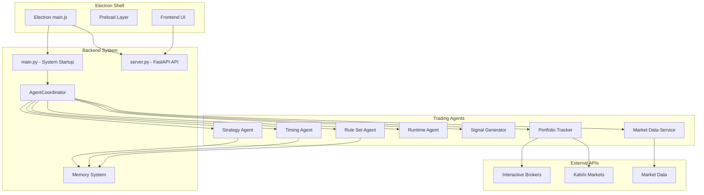

# Gremlin ShadTail Trader - Copilot Instructions

## System Overview

Gremlin ShadTail Trader is a sophisticated **multi-agent orchestrated trading system** that combines:
- **Electron Desktop App** - Main orchestrator and frontend shell
- **FastAPI Backend** - Python-based API server with agent coordination
- **Astro/TSX Frontend** - Modern web UI with real-time data display
- **15+ Specialized AI Agents** - Each handling specific trading functions
- **Vector Memory System** - ChromaDB-based learning and decision history
- **Multi-broker Integration** - IBKR and Kalshi API support

## System Architecture



## Agent Architecture Map

### Core Trading Agents (15 Total)

#### 1. **AgentCoordinator** (`agent_coordinator.py`)
- **Purpose**: Master orchestrator for all trading agents
- **Boot Priority**: First (after system startup)
- **Key Functions**: Decision synthesis, agent lifecycle management, coordination
- **Memory Integration**: Stores coordination decisions and outcomes
- **🚨 CRITICAL**: Do not modify orchestration logic without understanding all dependencies

#### 2. **StrategyAgent** (`Strategy_Agent/strategy_agent.py`) 
- **Purpose**: Trading strategy generation and market analysis
- **Dependencies**: Market data, memory system
- **Key Functions**: Signal generation, strategy evaluation, performance tracking
- **Outputs**: Trading signals with confidence scores

#### 3. **MarketTimingAgent** (`Timing_Agent/market_timing.py`)
- **Purpose**: Market timing optimization and entry/exit analysis
- **Dependencies**: Market data, technical indicators
- **Key Functions**: Timing analysis, market phase detection
- **Outputs**: Timing signals and optimal entry/exit points

#### 4. **RuleSetAgent** (`Rule_Set_Agent/rule_set_agent.py`)
- **Purpose**: Rule validation and compliance checking
- **Dependencies**: Rules engine, market data
- **Key Functions**: Rule evaluation, compliance monitoring
- **Outputs**: Rule validation results and compliance status

#### 5. **RuntimeAgent** (`Run_Time_Agent/runtime_agent.py`)
- **Purpose**: System runtime management and agent lifecycle
- **Boot Priority**: Second (manages other agents)
- **Key Functions**: Agent registration, health monitoring, resource management
- **🚨 CRITICAL**: Do not modify agent registration/startup sequence

#### 6. **SignalGenerator** (`Strategy_Agent/signal_generator.py`)
- **Purpose**: Technical signal generation and analysis
- **Dependencies**: Market data, technical analysis libraries
- **Key Functions**: Technical indicator calculation, signal strength assessment
- **Outputs**: Technical signals with confidence metrics

#### 7. **RulesEngine** (`Rule_Set_Agent/rules_engine.py`)
- **Purpose**: Rule processing and evaluation engine
- **Dependencies**: Rule definitions, market context
- **Key Functions**: Rule parsing, condition evaluation, result aggregation
- **Outputs**: Rule evaluation results

#### 8. **MarketDataService** (`Service_Agents/market_data_service.py`)
- **Purpose**: Market data acquisition and processing
- **Dependencies**: External market APIs, data providers
- **Key Functions**: Real-time data feeds, historical data retrieval
- **Outputs**: Structured market data for all agents

#### 9. **SimpleMarketService** (`Service_Agents/simple_market_service.py`)
- **Purpose**: Simplified market data for development/testing
- **Dependencies**: Mock data generators
- **Key Functions**: Test data generation, development support
- **Usage**: Development and testing environments

#### 10. **PortfolioTracker** (`Tool_Control_Agent/portfolio_tracker.py`)
- **Purpose**: Portfolio management and tracking
- **Dependencies**: Trading APIs, position data
- **Key Functions**: Position tracking, P&L calculation, risk assessment
- **Outputs**: Portfolio status and performance metrics

#### 11. **ToolControlAgent** (`Tool_Control_Agent/tool_control_agent.py`)
- **Purpose**: Tool and utility coordination
- **Dependencies**: Various system tools
- **Key Functions**: Tool orchestration, utility management
- **Outputs**: Tool status and coordination results

#### 12. **BaseMemoryAgent** (`Memory_Agent/base_memory_agent.py`)
- **Purpose**: Memory system management and learning
- **Dependencies**: ChromaDB, vector embeddings
- **Key Functions**: Memory storage, retrieval, learning from outcomes
- **🚨 CRITICAL**: Do not modify memory paths or embedding structure

#### 13. **StockScraper** (`Run_Time_Agent/stock_scraper.py`)
- **Purpose**: Data collection and web scraping
- **Dependencies**: Web scraping libraries, data sources
- **Key Functions**: Alternative data collection, news sentiment
- **Outputs**: Scraped market data and sentiment

#### 14. **TaxEstimator** (`Financial_Agent/tax_estimator.py`)
- **Purpose**: Tax calculations and estimates
- **Dependencies**: Trading history, tax rules
- **Key Functions**: Tax impact analysis, optimization suggestions
- **Outputs**: Tax estimates and optimization recommendations

#### 15. **IBKRTrader** (`Trade_Agents/IBKR-API.trader.py`)
- **Purpose**: Interactive Brokers API integration
- **Dependencies**: ib_insync library, IBKR credentials
- **Key Functions**: Order execution, position management
- **Status**: Optional (requires API credentials)

#### 16. **KalshiTrader** (`Trade_Agents/Kalshi-API.trader.py`)
- **Purpose**: Kalshi prediction market integration
- **Dependencies**: Kalshi API, credentials
- **Key Functions**: Prediction market trading
- **Status**: Optional (requires API credentials)

## System Startup and Orchestration Flow

### Boot Sequence (🚨 CRITICAL - Do NOT modify order)

1. **Electron Bootstrap** (`electron/main.js`)
   ```
   Electron starts → Backend processes → Frontend UI → IPC setup
   ```

2. **Backend Initialization** (`backend/main.py`)
   ```
   main.py → GremlinTradingSystem → Agent initialization
   ```

3. **Agent Coordinator Setup** (`agent_coordinator.py`)
   ```
   AgentCoordinator → RuntimeAgent → Individual agents → Registration
   ```

4. **Agent Initialization Order**:
   ```
   1. BaseMemoryAgent (memory system)
   2. RuntimeAgent (agent management)
   3. MarketDataService (data feeds)
   4. SimpleMarketService (dev data)
   5. SignalGenerator (technical signals)
   6. StrategyAgent (strategy logic)
   7. RulesEngine (rule processing)
   8. RuleSetAgent (rule validation)
   9. MarketTimingAgent (timing analysis)
   10. PortfolioTracker (portfolio management)
   11. ToolControlAgent (tool coordination)
   12. StockScraper (data collection)
   13. TaxEstimator (tax calculations)
   14. IBKRTrader (optional - if configured)
   15. KalshiTrader (optional - if configured)
   ```

### Trading Decision Flow

```
Market Analysis → Signal Generation → Rule Validation → 
Timing Optimization → Decision Synthesis → Execution Planning → Monitoring
```

1. **Market Analysis Phase**
   - Strategy Agent analyzes market conditions
   - Market Data Service provides real-time data
   - Signal Generator creates technical signals

2. **Decision Coordination Phase**
   - Agent Coordinator collects all agent inputs
   - Weighted confidence calculation across agents
   - Consensus threshold validation (default 70%)

3. **Execution Phase**
   - Portfolio risk assessment
   - Position sizing based on confidence
   - Rule validation before execution
   - Trading API coordination (IBKR/Kalshi)

4. **Learning Phase**
   - Outcome tracking and performance measurement
   - Memory system storage of decisions and results
   - Agent weight adjustment based on performance

## Memory System Architecture

### Vector Memory Store (`Gremlin_Trade_Memory/`)
- **Database**: ChromaDB (SQLite-based)
- **Location**: `backend/Gremlin_Trade_Memory/vector_store/`
- **Components**:
  - `chroma.sqlite3` - Main vector database
  - `metadata.db` - Metadata storage
  - `embedder.py` - Embedding management

### Memory Flow
```
Agent Decision → Text Embedding → Vector Storage → 
Similarity Search → Learning Feedback → Performance Improvement
```

### 🚨 CRITICAL Memory System Rules
- **NEVER** modify vector store paths
- **NEVER** change embedding structure without migration
- **NEVER** delete memory database files
- **ALWAYS** use `embedder.py` for memory operations

## Configuration Structure

### Backend Configurations

#### Core Config Directory: `backend/Gremlin_Trade_Core/config/Gremlin_Trade_Config/`

**🚨 CRITICAL: Never rename, move, or auto-modify any file in this directory**

- **`memory.json`**
  - **Purpose**: Memory system and embedding agent configuration
  - **Used by**: `base_memory_agent.py`, `embedder.py`
  - **Required for**: Correct initialization of backend memory agent and vector store
  - **Breakage Impact**: Memory system fails to initialize, no agent learning possible

- **`trade_agents.config`**
  - **Purpose**: Global agent registration and activation
  - **Used by**: All primary trade agents (`IBKR-API.trader.py`, `Kalshi-API.trader.py`), agent coordinator
  - **Required for**: Agent orchestration and agent boot
  - **Breakage Impact**: Agents fail to register, system cannot coordinate trading decisions

- **`trade_strategy.config`**
  - **Purpose**: Strategy mapping, weighting, and selector logic
  - **Used by**: `strategy_agent.py`, `strategy_manager.py`
  - **Required for**: Boot, live selection, and management of trading strategies
  - **Breakage Impact**: No trading strategies available, system cannot generate signals

#### Logging Directory: `backend/Gremlin_Trade_Core/config/Gremlin_Trade_Logs/`

**🚨 CRITICAL: Never rename, move, or auto-modify any file in this directory**

- **`Agents.out`**
  - **Purpose**: Live agent logs and health/status events
  - **Used by**: All agents, backend log aggregator
  - **Required for**: Traceability, debugging, IPC/health checks
  - **Breakage Impact**: No agent health monitoring, debugging becomes impossible

#### Root Config Directory: `backend/Gremlin_Trade_Core/config/`

- **`Agent_in.py`**
  - **Purpose**: Dynamic agent configuration at runtime
  - **Used by**: Agent bootstrap/coordination
  - **Required for**: On-the-fly config changes, agent injection
  - **Breakage Impact**: Cannot modify agent behavior without restart

- **`FullSpec.config`**
  - **Purpose**: Full system config for all agent classes and global orchestrators
  - **Used by**: `agent_coordinator.py`, global init
  - **Required for**: End-to-end orchestration, agent compatibility
  - **Breakage Impact**: System cannot start, no agent coordination possible

### Backend Memory/Vector Store

#### Memory Directory: `backend/Gremlin_Trade_Memory/vector_store/`

**🚨 CRITICAL: Never rename, move, or auto-modify any file in this directory**

- **`chroma.sqlite3`**
  - **Purpose**: Vector DB for embeddings and fast memory lookup
  - **Used by**: `embedder.py`, memory agent, backend recall
  - **Breakage Impact**: Complete loss of agent learning and memory

- **`metadata.db`**
  - **Purpose**: Metadata and tracking for vector/embedding states
  - **Used by**: `embedder.py`, agents needing persistent reference/state
  - **Breakage Impact**: Memory system corrupted, embeddings become unreliable

- **`git.keep`**
  - **Purpose**: Directory presence only; not a config file
  - **Note**: Ensures directory exists in git, safe to ignore

### Frontend Configurations

#### Core Frontend Config Files

- **`frontend/env.d.ts`**
  - **Purpose**: Typed environment variable mapping for Astro/TSX components
  - **Used by**: Frontend agent manager, state display, backend connection strings
  - **Required for**: Type safety and environment configuration

- **`frontend/astro.config.mjs`**
  - **Purpose**: Astro build and runtime config, routes, integration points
  - **Used by**: Astro/TSX, build scripts, static asset logic
  - **Required for**: Frontend build process and routing

- **`frontend/shadcn.config.js`**
  - **Purpose**: ShadCN UI library configuration (design system, themes)
  - **Used by**: Astro UI rendering, TSX components
  - **Required for**: Consistent UI theming and component styling

- **`frontend/tailwind.config.cjs`**
  - **Purpose**: TailwindCSS config for global styles/themes
  - **Used by**: All frontend components/pages
  - **Required for**: CSS styling and responsive design

#### Other Frontend Dependencies
- **`package.json`**, **`package-lock.json`** - Dependency and script management
- **`bin/`** - Go/utility binaries (not configs)

### Configuration Startup Order

#### Boot-Critical Configs (Required First)
1. **`FullSpec.config`** - Must load before any agent initialization
2. **`memory.json`** - Required for memory system before agents start
3. **`trade_agents.config`** - Needed for agent registration process

#### Runtime-Loaded Configs
- **`trade_strategy.config`** - Loaded during strategy initialization
- **`Agent_in.py`** - Dynamic loading during runtime
- **`Agents.out`** - Created/appended during operation

#### Static Configs (Never Reloaded)
- **Vector store files** (`chroma.sqlite3`, `metadata.db`) - Persistent storage
- **Frontend configs** - Build-time only, require restart to change

### 🚨 CRITICAL Configuration Rules

#### Absolute Path Dependencies
- **All config files are referenced by absolute paths** in agents, orchestrators, and memory agents
- **Never relocate** or rename config files without updating all references
- **Config structure changes** require system-wide testing and validation

#### Error Handling Requirements
- **If a config is missing**: Fail gracefully and emit descriptive error
- **Never hard-crash** the system due to config issues
- **Never drop agent/IPC health signals** due to config problems
- **Maintain system stability** even with malformed configs

#### Development vs Production
- **Development**: Config validation warnings, detailed error messages
- **Production**: Graceful degradation, minimal error exposure, backup configs

### Environment Configuration
- **Development**: Poetry + Astro dev server + Paper trading
- **Production**: Electron packaging + Built frontend + Live APIs

## Frontend-Backend Integration

### Communication Layers
1. **Electron IPC** (`electron/preload.js`)
   - File system access for Monaco editor
   - Configuration management
   - Tailscale tunnel control

2. **HTTP API** (`backend/server.py`)
   - RESTful endpoints for data retrieval
   - Agent status and control
   - Configuration management

3. **WebSocket** (`/ws/updates`)
   - Real-time market data
   - Agent status updates
   - Trading signals broadcast

### Key API Endpoints
- `/api/feed` - Trading feed data
- `/api/agents/status` - Agent health monitoring
- `/api/memory` - Memory system queries
- `/api/system/status` - System overview
- `/ws/updates` - Real-time WebSocket updates

## Testing and Validation

### Build and Test Commands
```bash
# Backend
cd backend
poetry install
poetry run python main.py

# Frontend
cd frontend
npm install
npm run dev

# Full System
npm run dev  # Runs all components
```

### Health Checks
- Backend: `http://localhost:8000/health`
- Frontend: `http://localhost:4321`
- Agent Status: `/api/agents/status`

## Copilot DOs and DON'Ts

### ✅ DO
- **Read existing code** thoroughly before making changes
- **Use existing patterns** for new features
- **Add comprehensive logging** for new functionality
- **Test changes** with development servers
- **Follow Python async/await** patterns for agents
- **Use TypeScript** for frontend components
- **Maintain error handling** patterns
- **Document new agents** or major changes
- **Use memory system** for agent learning
- **Follow agent registration** patterns

### ❌ DON'T
- **Modify agent initialization order** without understanding dependencies
- **Change memory system paths** or embedding structure
- **Remove error handling** or logging
- **Break IPC communication** between Electron and backend
- **Modify orchestration logic** without full system understanding
- **Delete configuration files** or change their structure
- **Rename, move, or auto-modify** files in critical config directories
- **Rewrite config file structure** or relocate configs without updating references
- **Generate new configs** unless explicitly instructed in repo docs or issues
- **Hard-crash system** or drop agent/IPC health signals due to config issues
- **Remove agent status tracking** or health monitoring
- **Change WebSocket communication** patterns
- **Modify Docker or deployment** configurations without testing
- **Remove async patterns** from agent code
- **Change file paths** in packaged Electron app
- **Modify Poetry dependencies** without version compatibility checking

### 🚨 CRITICAL - Never Modify Without Architectural Review
- `backend/main.py` - System startup sequence
- `backend/Gremlin_Trade_Core/agent_coordinator.py` - Agent orchestration
- `backend/Gremlin_Trade_Memory/` - Memory system
- `backend/Gremlin_Trade_Core/config/Gremlin_Trade_Config/` - **All config files**
- `backend/Gremlin_Trade_Core/config/Gremlin_Trade_Logs/` - **All log files**
- `backend/Gremlin_Trade_Memory/vector_store/` - **All memory database files**
- `electron/main.js` - Electron bootstrap and IPC
- `backend/server.py` - FastAPI endpoints and WebSocket
- Agent initialization sequence in `initialize_agents()`
- Memory embedding and storage patterns
- Configuration file structures and absolute paths

## Development Guidelines

### Adding New Agents
1. Inherit from `BaseMemoryAgent`
2. Implement required async methods (`start()`, `stop()`, `process()`)
3. Add to agent coordinator initialization
4. Register with runtime agent
5. Add status tracking and health monitoring
6. Implement memory integration for learning

### Adding New Features
1. Follow existing async patterns
2. Add comprehensive error handling
3. Integrate with memory system for learning
4. Add API endpoints in `server.py`
5. Update frontend components as needed
6. Add health checks and status monitoring

### Configuration Changes
1. Update relevant config files
2. Maintain backward compatibility
3. Add migration scripts if needed
4. Update documentation
5. Test in both dev and production modes

## Production vs Development

### Development Mode
- Uses Poetry for Python dependencies
- Astro dev server for frontend hot reload
- Paper trading mode (no real money)
- Enhanced logging and debugging
- Chrome DevTools available

### Production Mode
- Electron packaged application
- Built and optimized frontend
- Real API integrations (with credentials)
- Minimal logging for performance
- Desktop application distribution

## Error Handling and Recovery

### Agent Failure Recovery
- Individual agents can fail without system crash
- Runtime agent monitors and restarts failed agents
- Memory system preserves learning across restarts
- Graceful degradation when optional agents unavailable

### System Recovery
- Comprehensive logging for debugging
- Health check endpoints for monitoring
- Backup and restore for memory system
- Configuration validation on startup

---

**Remember**: This is a complex multi-agent system where each component depends on others. Always understand the full impact of changes before implementation. When in doubt, preserve existing patterns and add comprehensive logging.